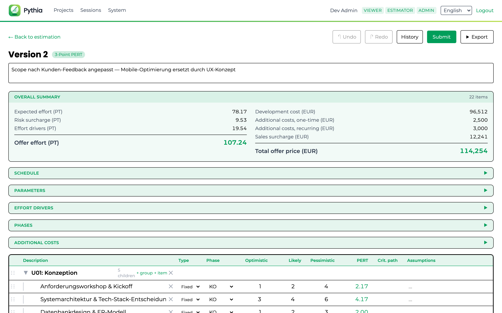
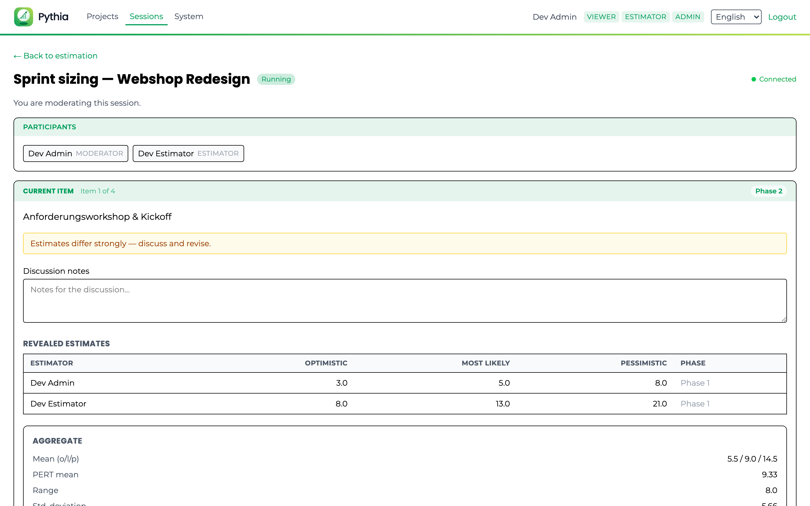
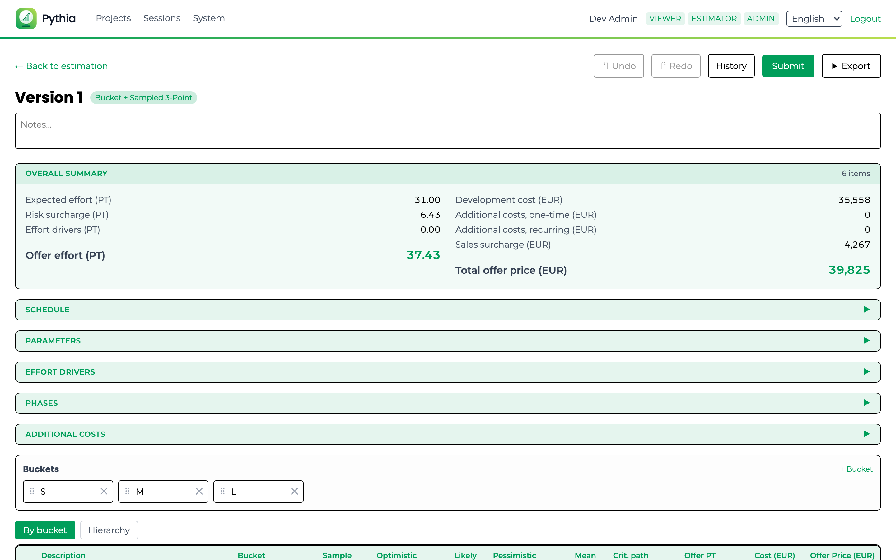
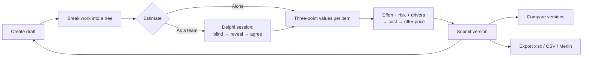

<p align="center">
  
</p>

<h1 align="center">Pythia</h1>

<p align="center">
  <strong>Turn a wish-list of features into a defensible offer price —<br>
  estimated by your whole team, versioned, and traceable.</strong>
</p>

<p align="center">
  
  
  
  
  
  
</p>

---

## What it does

Pythia is an effort-estimation tool for software projects. You break the work into an
arbitrarily deep tree of packages and items, capture a **three-point estimate**
(optimistic / most likely / pessimistic) for each one, and Pythia turns that into an
expected effort with an explicit risk surcharge — then into money, applying your daily
rate, effort drivers, additional costs and sales surcharge.

The result is a **total offer price you can defend line by line**, not a number someone
typed into a cell. Every estimate is versioned, every change is attributable, and the
whole team can estimate together in a structured session rather than in a meeting where
the loudest voice wins.

<p align="center">
  
</p>

## Why not a spreadsheet?

Spreadsheets are fine but break easily and are often not fun to use. Pythia adds these things a spreadsheet cannot give you:

| | Spreadsheet | Pythia |
|---|---|---|
| **Team estimates** | Whoever speaks first anchors everyone | Blind individual estimates, then a reveal that highlights disagreement |
| **History** | `offer_final_v3_REALLY_final.xlsx` | Draft → submitted versions, with a diff between any two |
| **Mistakes** | Ctrl+Z, until you close the file | Per-user undo/redo that survives a restart |
| **Accountability** | "Who changed this cell?" | An audit trail of who changed what, and when |
| **Trust in the maths** | Formulas copied between sheets, drifting | One calculation engine, compiled once and shared by server and browser — the numbers cannot disagree |

## Features

### Estimating

- **Three-point PERT** — optimistic / most likely / pessimistic per item, with the expected value and a standard-deviation risk surcharge derived for you.
- **Bucket + sampled PERT** — for large backlogs: sort items into size buckets, estimate a few samples per bucket, and the rest inherit the bucket average.
- **Arbitrarily deep trees** — group work into packages and sub-packages; totals roll up automatically. Rearrange by dragging with the mouse *or* the keyboard.
- **Effort drivers** — named multipliers (legacy integration, regulatory audit, an unfamiliar stack) applied across the estimate.
- **Phases and time-relative items** — model effort that scales with how long a phase runs.

### Estimating together

<p align="center">
  
</p>

- **Wideband-Delphi sessions** — everyone estimates the current item **blind**; nobody sees anyone else's number, only how many have submitted.
- **Reveal and discuss** — the moderator opens the round: all estimates appear side by side, with the spread, the PERT mean, and a warning when the team disagrees strongly.
- **Revise, agree, finalize** — estimators can change their number after the discussion; the agreed result is written straight back onto the estimate, together with the discussion notes.
- **Live for everyone** — the room updates in real time, and the connection state is shown honestly, so you always know whether what you are looking at is current.
- **Pause and resume** — a session that runs out of time can be parked and picked up later, or ended early while keeping everything decided so far.

### Governing the numbers


- **Versioned snapshots** — work on a draft, submit it, and it becomes immutable. The next draft starts from it.
- **Compare any two versions** — see exactly which items, parameters and costs moved between two offers.
- **Persistent undo/redo** — per user, surviving a browser restart, with a visible history.
- **Roles and audit** — VIEWER / ESTIMATOR / ADMIN, with an audit trail behind every change.

### From effort to price

- Daily rate, risk surcharge and effort-driver surcharge, shown as separate lines rather than baked into one number.
- **Additional costs**, one-time and recurring, assignable to a phase.
- **Sales surcharge** applied the way your commercial template expects it.
- A whole-estimate summary that always shows the current **total offer price**.

### Working with your tools

<p align="center">
  
</p>

- **Excel and CSV export** of any version.
- **Merlin Project round-trip** — import a work breakdown structure, estimate it here, and write the calculated effort back into the plan.
- **German and English UI**, switchable per user.
- **Make it yours** — an administrator can set the organisation's name, pre-load the standard effort drivers every new estimate should start with, and upload a stylesheet to match your corporate design.

## How an estimate flows



## Quick start

You need **JDK 21**, **Node.js**, and **Docker running** (the dev profile starts a
throwaway PostgreSQL for you).

```bash
git clone <this repository>
cd pythia
./scripts/dev.sh
```

Then open **<http://localhost:5173>**. The backend serves on `:8090`.

The dev profile seeds three demo projects with realistic estimates, so there is something
to look at immediately, and it signs you in through a development login picker where you
can switch between a viewer, an estimator and an administrator.

For a full build and the test suite:

```bash
./gradlew build                       # domain + backend + frontend, all tests
cd src/frontend && npm run test:e2e   # Playwright end-to-end suite
```

## Documentation

- [Architecture](docs/architecture.md) — how the pieces fit together and why the domain is shared code
- [Development](docs/development.md) — prerequisites, build commands, profiles, and troubleshooting
- [Estimation sessions](docs/estimation-sessions.md) — the collaborative flow in detail
- [Authentication](docs/authentication.md) — roles, and the pluggable auth modules
- [Entra ID setup](docs/entra-setup.md) — wiring up Microsoft Entra ID for production

## Built with

Kotlin Multiplatform for the shared calculation domain, Quarkus 3 (Java 21) and PostgreSQL
on the server, SvelteKit 5 with Tailwind in the browser, packaged as reproducible container
images and deployable to Kubernetes. See [Architecture](docs/architecture.md) for the
reasoning — in particular why the estimation maths is compiled once and shared, rather than
implemented twice.

## Licence

Licensed under the [Apache License 2.0](LICENSE).
