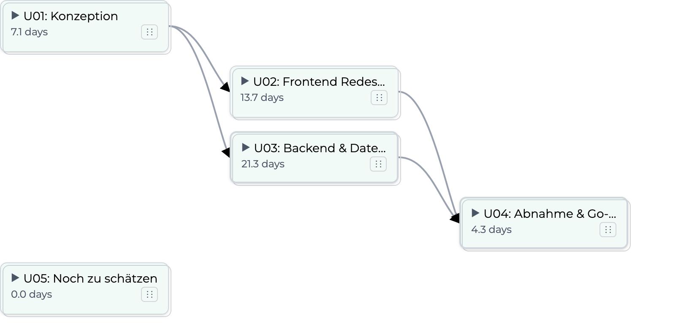
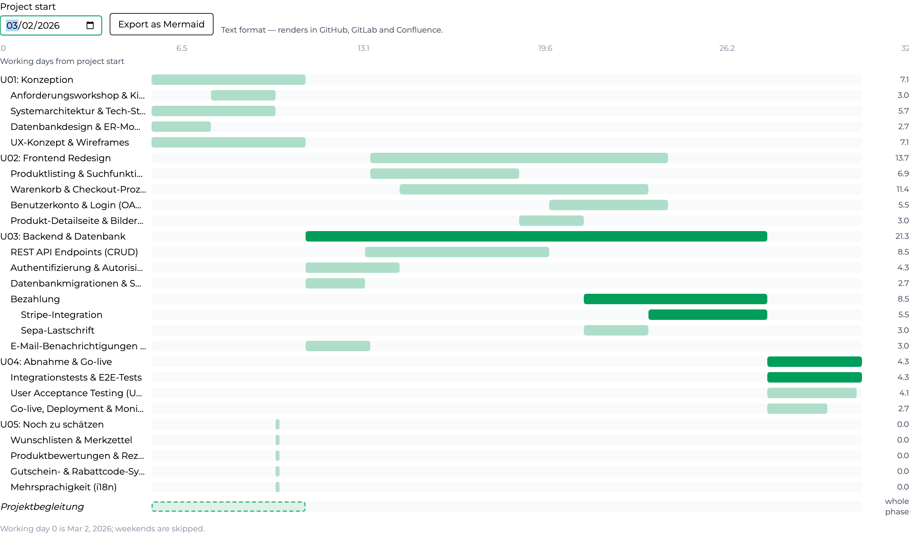

# Scheduling: dependencies, the critical path and the Gantt

An estimate answers what the work costs. Linked into a net plan, the same
numbers also answer how long it takes. This document explains what the
scheduler consumes, what it produces, and — most importantly — why it reports
**two different durations** that are not meant to agree.

The whole computation lives in one place,
`src/domain/core/src/main/kotlin/io/pythia/model/ProjectSchedule.kt`, and is
shared by the server and the browser like every other calculation here. Nothing
re-derives a date.

## What goes in, and what comes out

The scheduler takes three things: one estimation version's tree, a set of
**finish-to-start** dependencies between its items, and a team size. It returns
a `ProjectSchedule` — a scheduled task per tree node (earliest start, earliest
finish, duration, and whether it is critical), a project length, an uncertainty
band, and a window per phase.

One trap worth knowing before anything else: the schedule must be computed on a
**calculated** version. A node's effort in days derives from the calculation
parameters that `calculate()` stamps onto the tree, so on an uncalculated
version every duration is zero and the plan looks instantaneous.

  

## Leaves are scheduled; groups are roll-ups

Only leaves consume time. A group is not scheduled as a block of work — it is
lowered into two zero-duration milestones, `g#start` and `g#finish`, wired
around its children. The milestones respect predecessors but occupy no worker,
so a group's dates are always derived from what is inside it.

A dependency you draw between two groups therefore lowers to a single edge
between the relevant milestones, not to an edge per pair of leaves. That is a
deliberate choice: expanding a link between two fifty-leaf groups into every
leaf pairing would be two and a half thousand edges, and the tempting
alternative — "start after the other group's last finish" — cannot work,
because that finish is not known until the group has been scheduled.

Two smaller rules follow the same spirit of refusing to fail loudly over
harmless input: an edge naming an item that no longer exists is ignored rather
than thrown on, and a duplicate edge never counts twice.

## Accompanying work sits outside the net plan

Items measured in hours per week — project management, UX support, anything
that simply runs while the project runs — are **excluded** from the graph
rather than given a zero length, and they cannot be the target of a
dependency.

The reason is circularity, not tidiness. Such an item's effort is derived from
the length of the phase it belongs to. Scheduling it would make the plan depend
on a number that is itself derived from the plan. Excluding it keeps the net
plan solvable; the Gantt still shows the work, drawn across its whole phase.

## A team is a number of workers

Team size is a headcount, not a divisor. The scheduler turns it into worker
slots and levels the work across them: at most that many real items are ever in
flight at once, and an item starts when both its predecessors are finished
**and** a worker is free.

A fractional team size rounds down, with a floor of one — 2.5 people schedule
as two concurrent workers, because half a person cannot take an item.

## Two durations, and why they differ

This is the part that confuses people, so it is worth stating plainly. The
schedule reports:

- **The planned length** — the levelled makespan. When the last item finishes,
  given the team you actually have. This is the number to quote as a duration.
- **The uncertainty band** — an expected duration with a standard deviation,
  and an optimistic and a pessimistic figure derived from it using the
  version's standard-deviation factor.

The band is **not** computed from the levelled dates. It follows the longest
dependency path, measured while ignoring capacity, and accumulates that path's
own mean and variance. The planned length is a **separate** reading and need
not agree with it — in fact it will usually be larger, because after levelling
an item can finish late merely because the team was busy, which says nothing
whatever about how uncertain the estimate was.

Two further details, both there to avoid double-counting. The band accumulates
along one longest path, so two parallel critical branches are not added
together. And it is read from the path's own mean and variance rather than from
the planned length, because the offered effort already carries a
standard-deviation loading — banding around it would apply the same sigma
twice.

## The critical path

An item is critical when it has no slack: its latest permissible finish equals
its earliest finish, up to a small epsilon. The scheduler computes this over
leaves, and the result is surfaced in two places — marked in the schedule view,
and as a column on the main estimation table, so it is visible while you are
still estimating rather than only after you go looking for it.

Because slack is computed after levelling, the critical path here is a critical
**chain**: an item can be critical due to the team's capacity as much as due to
its predecessors.

## When the schedule refuses to compute

There are exactly two failure modes, and both come back as a typed error rather
than a wrong number.

- **A cycle.** The items caught in the loop are named. In the editor a cycle is
  refused *as you draw it*: the link that would close the loop is explained and
  offered for cancellation, so an impossible plan is never created and there is
  no repair screen to visit afterwards.
- **An unusable team size.** Zero or negative is rejected outright.

## Phase windows: specified or computed

Every phase gets a window — its earliest start, its earliest finish, and how
many scheduled leaves fall inside it — over a five-day working week.

A phase's length can be either **specified** by hand or **computed from the net
plan**, chosen per phase. Computing it closes the loop that used to be left to
the estimator: the phase length that accompanying work is measured against then
comes from the same dependency graph as everything else, instead of being a
number somebody kept in step manually.

## The Gantt chart and the Mermaid export

The chart maps working-day offsets onto a start date you choose. Weekends are
skipped; nothing else in the calendar is — no non-working day beyond Saturday
and Sunday is modelled, so a plan crossing a shutdown period needs that read in
by hand.

The chart also exports as Mermaid text, which can be pasted into a document or
a wiki and keeps rendering there without an image.

  

## Where this lives

- **Domain** — `ProjectSchedule.kt` in `:domain:core`: the graph lowering, the
  levelled forward pass, the backward pass, the band and the phase windows.
- **Persistence and REST** — the dependencies and the team size are stored per
  version and served with it.
- **Frontend** — the schedule route under a version, holding the dependency
  editor and the chart; both read the domain result and neither recomputes it.
- **Tests** — `src/frontend/e2e/schedule.test.ts` covers the editor, the
  refusal of a cycle, and the chart.
